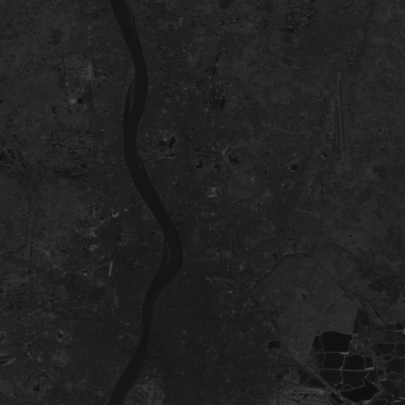
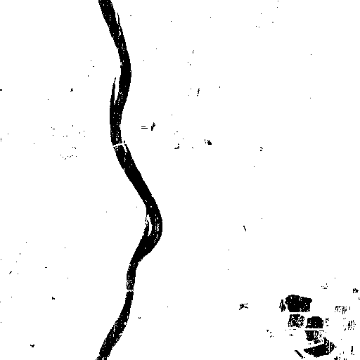

# What is it?

- It is A Scratch Implementation of Bayes Decision Rule .

# Process

- pick any of .gif file, and replace "img_filename" with the .gif file in "annote_image_points.py" u want to use
- run "annote_image_points.py" click 150 points on the non river portion and 50 points on river portion.
- as you complete clicking new .csv file will generate (ex: annotated_points_band4_np_50.csv, annotated_points_band4_np_150.csv)
- now run the ipynb notebook.

# Result

- You will get a segmentation image of River and non river portions, Done by classification algorithm Naive Bayes.

Sample input Image

Segregated Output Image
 